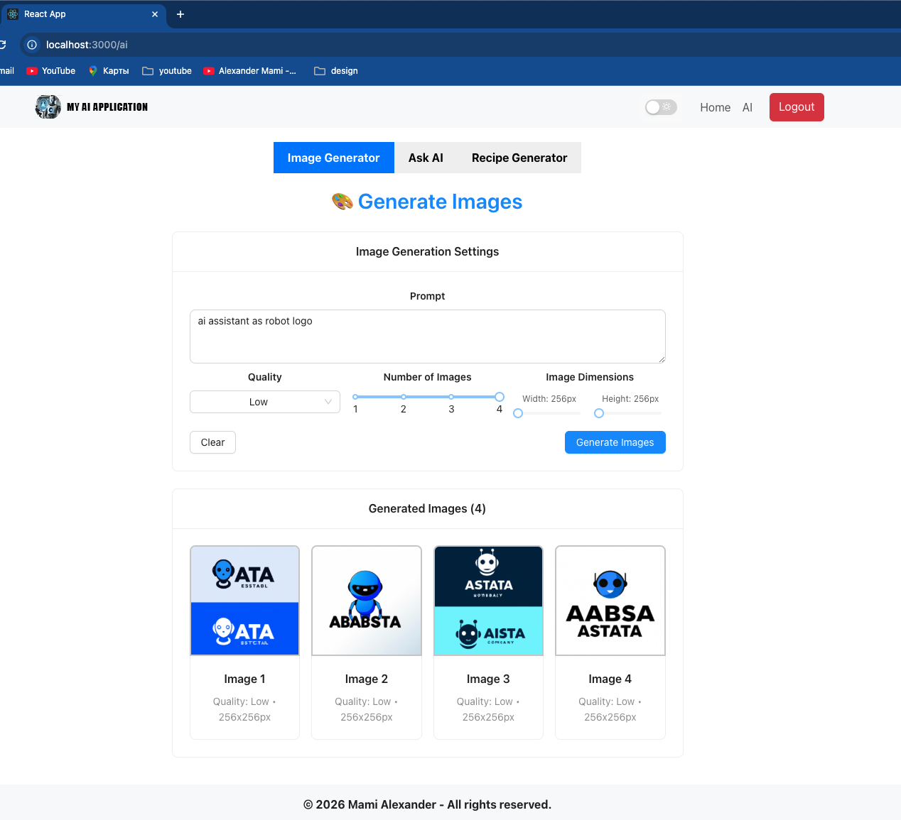
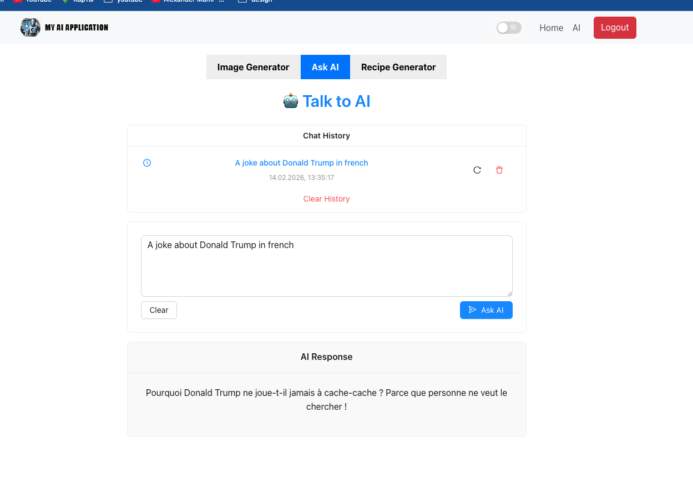
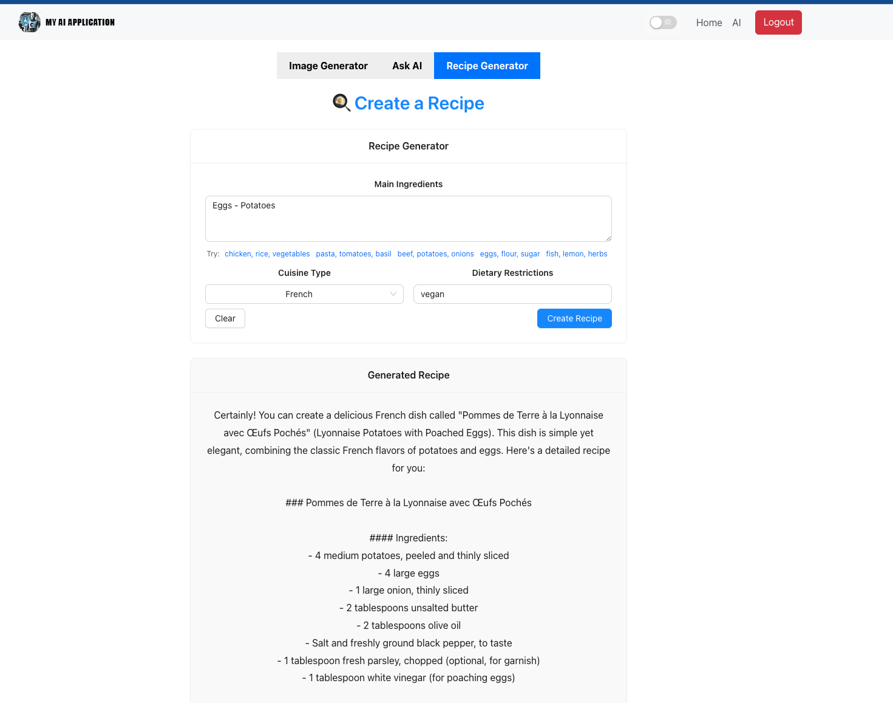

## The live application uses a more comprehensive production stack.

🔗 **[Live Demo](https://ai.mamialex.ru/)**

### 🏗️ Architecture Overview

The deployed system consists of:

Frontend client (SPA)

Spring Boot backend API

AI integration layer (Spring AI + OpenAI)

Authentication system

Email verification service

Database layer

Cloud hosting & deployment infrastructure

## 🛠️ Full-Stack Technologies Used

🔹 Backend - deployed on [Render](https://ai-app-sb-1-0.onrender.com/) (free tier)

Spring Boot

Spring AI (spring-ai-openai-spring-boot-starter)

OpenAI API

Spring Security (JWT Authentication)

REST APIs

🔹 Frontend

React (SPA)

TypeScript

Axios (API communication)

Modern UI component library

🔹 Authentication & Security

JWT-based authentication

Email verification flow

Password encryption (BCrypt)

🔹 Database

PostgreSQL

JPA / Hibernate

🔹 DevOps & Deployment

Docker

Docker Compose

Cloud VPS hosting

Nginx (Reverse Proxy)

HTTPS (SSL configuration)

## 🔐 Production Features

User registration & login

Email confirmation

Secured API endpoints

Environment-based configuration

Rate limiting for AI endpoints

Error handling & logging